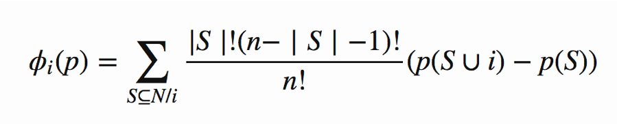
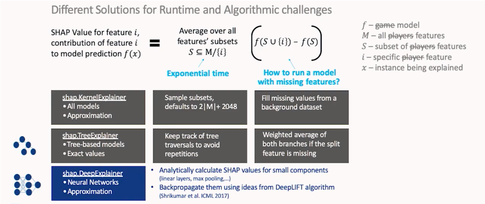
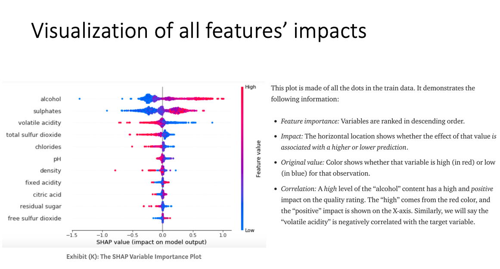
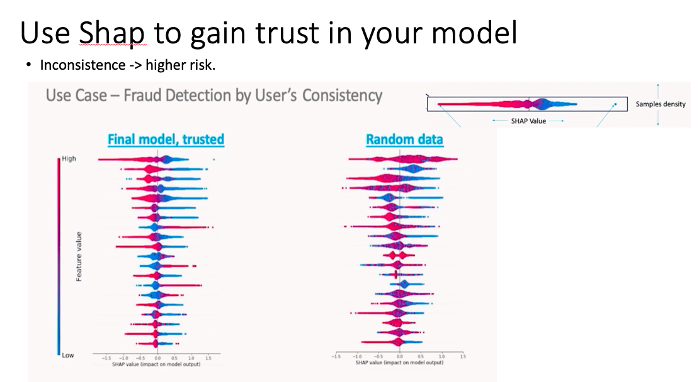
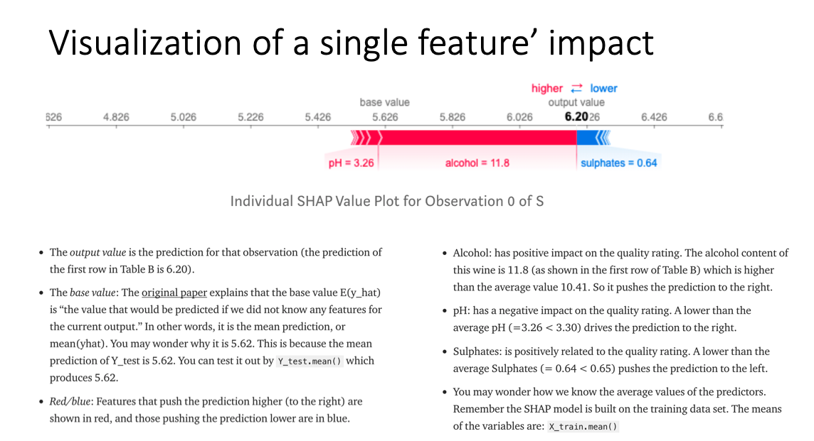

# shapley-values-deep-explainer
It is a technique used in game theory to determine how much each player in a collaborative game has contributed to its success.
How much has each feature value contributed to the prediction compared to the average prediction?

## In detail:
Shapley wants to calculate the contribution of each player in a coalition game. 

Assume there are N players and S is a subset of the N players. 
Let p(S) be the total value of the S players. When player i join the S players, Player i’s marginal contribution is  p(S∪{i}) −  p(S). 

If we take the average of the contribution over the possible different permutations in which the coalition can be formed, we get the right contribution of player i:

## Algorithms:

## Plots: 
 
 
 
